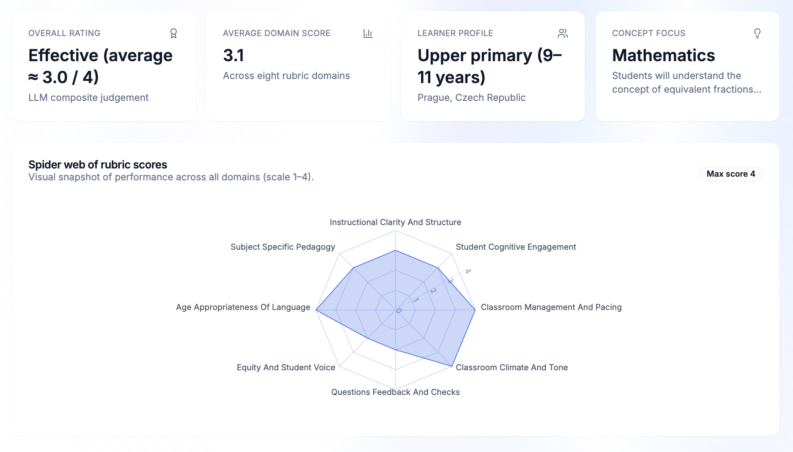

# Teacher AI Assistant

Teacher AI Assistant is an end-to-end workflow for turning raw classroom audio into rubric-aligned coaching insights. A Django service transcribes MP3 uploads with Whisper, prompts an LLM with rigorous observation rules, and sends structured JSON back to a modern Next.js dashboard that visualization coaches can act on immediately.





> 🎤 Pitch-ready slides live in [`docs/readme/Teacher-AI-Assistant.pdf`](docs/readme/Teacher-AI-Assistant.pdf). Use them together with the screenshots above when presenting the frontend.

## Highlights
- Evidence-based lesson feedback: transcripts, 8-domain rubric scores, global strengths, growth priorities, and concrete next steps generated in JSON.
- Whisper-powered Czech (and multilingual) transcription with configurable models, caching, and fallback handling.
- Next.js 14 dashboard built with Tailwind CSS, shadcn/ui primitives, and Recharts to visualize LLM output and lesson metadata.
- Clear environment-driven configuration for swapping LLM providers (OpenAI ↔ Featherless) and tuning Whisper models without code changes.
- Demo assets (sample audio, REST client snippet, PDF deck, screenshots) so stakeholders can understand the flow before wiring real data.

## System Overview
1. A coach uploads an MP3/WAV/M4A plus lesson context (as fields or JSON metadata) via the dashboard or any HTTP client.
2. Django saves the upload, resamples audio with `librosa`, and transcribes it using OpenAI Whisper through `CzechTranscriber`.
3. Metadata is merged with sensible defaults through `LessonContext` and injected into the “Classroom Audio Evaluator” prompt.
4. `LLMEvaluator` calls an OpenAI-compatible API (OpenAI by default, Featherless supported) to score each rubric domain and generate narrative feedback.
5. The API response bundles `{ metadata, transcript, evaluation }` as JSON.
6. The dashboard consumes the payload, rendering radar charts, coaching headlines, evidence tables, and a transcript viewer.

## Architecture in Brief
| Layer | Responsibility | Key files |
| --- | --- | --- |
| HTTP API (Django 5) | `/api/evaluate/` endpoint, payload parsing, error handling | `teacher_backend/evaluation/views.py`, `teacher_backend/teacher_backend/urls.py` |
| Transcription service | Whisper model loading, caching, resampling, fallbacks | `teacher_backend/evaluation/services/transcription.py`, `.../czech_transcriber.py` |
| Prompting + LLM | Prompt templates, metadata schema, OpenAI/Featherless client | `teacher_backend/evaluation/prompts.py`, `schemas.py`, `services/evaluator.py` |
| Frontend dashboard | Lesson upload, radar chart, tables, transcript view | `dashboard_ui/src/app/page.tsx`, `src/components/*`, `src/data/sample-evaluation.ts` |
| Docs & assets | Presentation deck + marketing screenshots | `docs/readme/*` |

## Repository Layout
```
.
├── dashboard_ui/           # Next.js dashboard (Tailwind, shadcn/ui, Recharts)
├── teacher_backend/        # Django project + evaluation app + Whisper integration
├── docs/readme/            # Screenshots + Teacher-AI-Assistant.pdf deck
├── project.md              # Architecture brief / talking points
├── req.rest                # HTTPie/curl-ready sample requests
├── zaznam1.mp3             # Sample classroom audio for testing
├── zaznam2.mp3             # Second sample audio file
├── a.py                    # Pymongo connectivity smoke test
└── README.md               # (this file)
```

---

## Backend Service (Django + Whisper)

### Prerequisites
- Python 3.12+
- FFmpeg available on PATH (required by Whisper/librosa)
- Whisper downloads ~1–2 GB per model on first run; ensure disk space

### Environment Variables
Create `teacher_backend/.env` (copy from `.env.example`) and fill the most important keys:

| Variable | Description |
| --- | --- |
| `OPENAI_API_KEY` | Required unless `FEATHERLESS_API_KEY` is set. |
| `FEATHERLESS_API_KEY` | Optional: use Featherless.ai (default model `Meta-Llama-3.1-70B-Instruct`). |
| `LLM_MODEL` | Override chat completion model (default `gpt-4o-mini`). |
| `LLM_TEMPERATURE` | Float; defaults to `0.1`. |
| `WHISPER_MODEL` | Whisper checkpoint (`small` default, fallbacks configurable). |
| `WHISPER_LANGUAGE` | BCP-47 code; defaults to `cs`. |
| `DJANGO_SECRET_KEY` | Supply your own for production. |
| `DJANGO_CORS_ALLOWED_ORIGINS` | Comma-separated list (`http://localhost:3000` by default). |

Additional knobs: `WHISPER_CACHE_DIR`, `WHISPER_MODEL_FALLBACKS`, `OPENAI_BASE_URL`, `FEATHERLESS_BASE_URL`.

### Quick Start
```bash
cd teacher_backend
python -m venv .venv
source .venv/bin/activate
pip install -r requirements.txt
python manage.py migrate
python manage.py runserver 0.0.0.0:8000
```

The first transcription call downloads and caches Whisper under `teacher_backend/.cache/whisper/`.

### Send an Evaluation Request
Use the provided `req.rest` snippet or curl manually:

```bash
curl -X POST http://127.0.0.1:8000/api/evaluate/ \
  -F "audio=@/absolute/path/to/zaznam1.mp3" \
  -F 'metadata={
        "teacher_name":"Ms. Novak",
        "subject":"Mathematics",
        "age_group":"Upper primary (9–11 years)",
        "lesson_type":"Practice / consolidation"
      }'
```

Successful responses look like:

```json
{
  "metadata": { "...resolved lesson context..." },
  "transcript": "Full Whisper transcript...",
  "evaluation": { "...strict JSON rubric output..." }
}
```

### Operational Notes
- Errors are surfaced as `{ "error": "..." }` with HTTP 4xx/5xx codes.
- `/health/` returns `{ "status": "ok" }` for monitoring.
- Heavy transcription should be offloaded to workers in production; the demo server executes inline for simplicity.

## Frontend Dashboard (Next.js 14)

The dashboard (`dashboard_ui/`) showcases the evaluation JSON through cards, radar charts, tabbed strengths/growth panes, an evidence table, and a lesson upload form.

### Setup
```bash
cd dashboard_ui
cp .env.local.example .env.local   # set NEXT_PUBLIC_API_BASE_URL if your backend is remote
npm install
npm run dev                        # http://localhost:3000
```

**Requirements:** Node.js ≥ 18.17, npm 9+, modern browser (Chrome/Edge/Safari).

### Wiring to the Backend
- The upload form (`src/components/lesson-upload-form.tsx`) collects metadata and audio into `FormData`.
- The default implementation in `src/app/page.tsx` calls `generateMockEvaluation` so the UI works without the API. Replace the body of `handleLessonUpload` with a `fetch` to `${process.env.NEXT_PUBLIC_API_BASE_URL}/api/evaluate/` to go live:

```ts
const response = await fetch(`${process.env.NEXT_PUBLIC_API_BASE_URL}/api/evaluate/`, {
  method: "POST",
  body: formData
});
if (!response.ok) throw new Error("Evaluation failed");
const result = await response.json();
setEvaluation(result.evaluation);
setLatestTranscript(result.transcript);
setResolvedMetadata(result.metadata);
```

- Radar and stat tiles automatically update once `setEvaluation` receives the backend payload.
- `src/data/sample-evaluation.ts` supplies seeded content for local demos; adjust to reflect your rubric if needed.

## Docs, Assets & Samples
- `docs/readme/Teacher-AI-Assistant.pdf` – presentation-ready overview of the project.
- `docs/readme/screenshot*.png` – three UI angles sized for README/pitch decks.
- `zaznam1.mp3`, `zaznam2.mp3` – anonymized Czech lesson clips to test Whisper + LLM flow.
- `req.rest` – copy/paste POST request for clients like VS Code REST Client or curl.
- `project.md` – strategic brief you can hand to stakeholders or contributors.

## Tech Stack
- **Backend:** Python 3.12, Django 5.0+, OpenAI Whisper, `openai` SDK, librosa, PyTorch, SQLite (can swap).
- **Frontend:** Next.js 14 App Router, TypeScript, Tailwind CSS, shadcn/ui, Recharts, Lucide icons.
- **Tooling:** npm, ESLint, TypeScript, curl/REST Client for manual testing.

---

_Built as a 2-day DigiEduHack project by Filip Karika, Jakub Studnička, and Alibi Yermekov._
